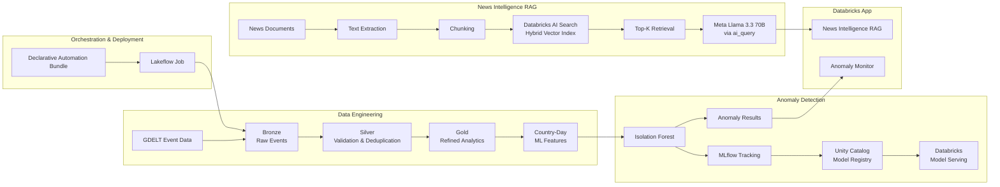
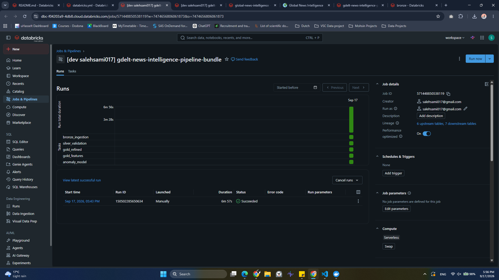
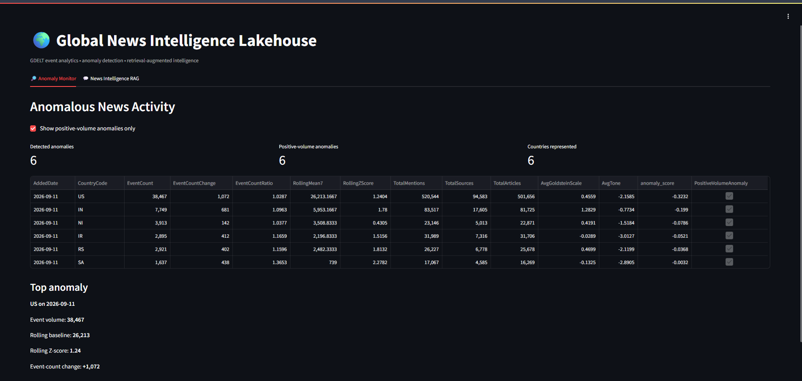
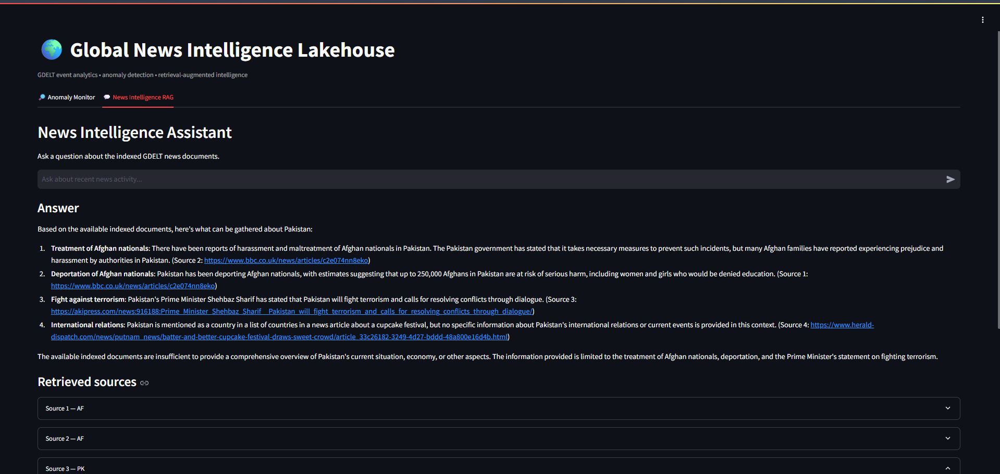

# 🌍 Global News Intelligence Lakehouse

End-to-end Databricks lakehouse for GDELT news analytics, anomaly detection, MLflow model serving, AI Search RAG, and Lakeflow orchestration.

## Overview

This project ingests GDELT global event data into a governed Bronze/Silver/Gold lakehouse, engineers country-level temporal features, detects unusual event-volume behavior with an unsupervised Isolation Forest model, and exposes the results through a Databricks App.

A separate RAG path processes news documents into chunks, indexes them with Databricks AI Search, retrieves relevant context for a user query, and generates grounded answers with Meta Llama 3.3 70B Instruct.

## Architecture



## Databricks Components

- Unity Catalog
- Delta Lake
- Lakeflow Jobs
- Databricks Declarative Automation Bundles
- MLflow Tracking
- Unity Catalog Model Registry
- Databricks Model Serving
- Databricks AI Search
- Databricks Apps
- Serverless SQL and compute

## Data Engineering

### Bronze

Raw GDELT Event Database files are ingested into Delta tables while preserving source fidelity.

### Silver

Records are validated and cleaned using checks for:

- duplicate events
- tolerant numeric parsing
- geographic values
- date validity

### Gold

Curated event data is aggregated into country/day analytics and ML-ready feature tables.

Verified prototype metrics:

- **1,217,961 clean GDELT event records**
- **0 duplicate `GlobalEventID` values after cleanup**
- **2,640 country/day ML feature rows**

## Machine Learning

An unsupervised `IsolationForest` model detects unusual country-level event-volume behavior using engineered temporal and activity features such as:

- event count
- previous event count
- event-count change
- event-count ratio
- rolling mean
- rolling standard deviation
- rolling z-score
- article count
- mention count
- source count
- average Goldstein scale
- average tone

The model was trained with scikit-learn and tracked with MLflow.

Verified test results:

- **427 test observations**
- **24 anomalies**
- **5.62% anomaly rate**

Registered model:

`workspace.gold.gdelt_isolation_forest`

The model was registered in Unity Catalog, deployed through Databricks Model Serving, and successfully invoked through its REST endpoint.

## Retrieval-Augmented Generation

A separate RAG path processes news documents into chunks and indexes them with Databricks AI Search.

AI Search configuration:

- Index: `workspace.gold.news_chunks_index`
- Source table: `workspace.gold.news_chunks`
- Index type: Delta Sync
- Search mode: Hybrid
- Embedding model: `databricks-gte-large-en`
- Indexed chunks: **765**

RAG flow:

1. User submits a question.
2. Databricks AI Search retrieves the most relevant chunks.
3. Retrieved chunks are assembled into grounded context.
4. `system.ai.meta-llama-3-3-70b-instruct` generates the final answer through `ai_query`.
5. The answer is displayed in the Databricks App.

## Databricks App

The deployed application contains two working views.

### 🔎 Anomaly Monitor

Displays anomalous country/day news activity produced by the structured GDELT event pipeline.

### 💬 News Intelligence RAG

Answers questions over indexed news-document chunks using retrieval-augmented generation.

## Orchestration

The core ETL and ML workflow is orchestrated as a Lakeflow Job:

```text
bronze_ingestion
      ↓
silver_validation
      ↓
gold_refined
      ↓
gold_features
      ↓
anomaly_model
```

Verified runs:

- Manual Lakeflow run: **3m 59s**
- Bundle-managed run: **6m 57s**
- All five tasks completed successfully on serverless compute

## Deployment as Code

The repository includes a `databricks.yml` Declarative Automation Bundle that defines the Lakeflow Job and task dependencies.

Typical bundle lifecycle:

```bash
databricks bundle validate
databricks bundle deploy
databricks bundle run gdelt_news_intelligence_pipeline
```

## Repository Structure

```text
global-news-intelligence-lakehouse/
├── app/
│   ├── app.py
│   ├── app.yaml
│   └── requirements.txt
├── docs/
│   └── images/
│       ├── lakeflow-job-success.png
│       ├── anomaly-monitor.png
│       ├── rag-assistant.png
│       └── ai-search-index.png
├── notebooks/
│   ├── 01_gdelt_bronze_ingestion.ipynb
│   ├── 02_gdelt_silver_validation.ipynb
│   ├── 03_gdelt_gold_refinedData.ipynb
│   ├── 03_gdelt_gold_features(acc to gpt).ipynb
│   ├── 04_gdelt_anomaly_model.ipynb
│   └── ...
├── docs/img/..
└── databricks.yml
```

## Screenshots

### Lakeflow Job



### Anomaly Monitor



### News Intelligence RAG



## Key Engineering Decisions

- Kept raw ingestion separate from validation and analytics transformations.
- Used Delta tables as persistent governed storage while Spark DataFrames handled transformations.
- Separated ML training from MLflow experiment tracking and model lifecycle management.
- Used a dedicated Databricks App service principal with least-privilege Unity Catalog access.
- Kept the structured anomaly-detection path separate from the unstructured RAG path.
- Used measured project metrics instead of estimated or fabricated scale claims.

## Tech Stack

Python · PySpark · SQL · Delta Lake · Databricks · Unity Catalog · Lakeflow Jobs · MLflow · scikit-learn · Isolation Forest · Databricks Model Serving · Databricks AI Search · Vector Search · RAG · Meta Llama 3.3 70B Instruct · Streamlit · GitHub

## Project Status

Completed and verified:

- Bronze / Silver / Gold lakehouse pipeline
- data-quality validation and deduplication
- country-level ML feature engineering
- Isolation Forest anomaly detection
- MLflow experiment tracking
- Unity Catalog model registration
- Databricks Model Serving
- Databricks AI Search
- semantic retrieval
- RAG generation
- deployed Databricks App
- Lakeflow Job orchestration
- Declarative Automation Bundle deployment
- GitHub repository documentation
